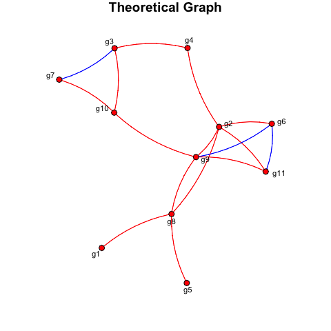
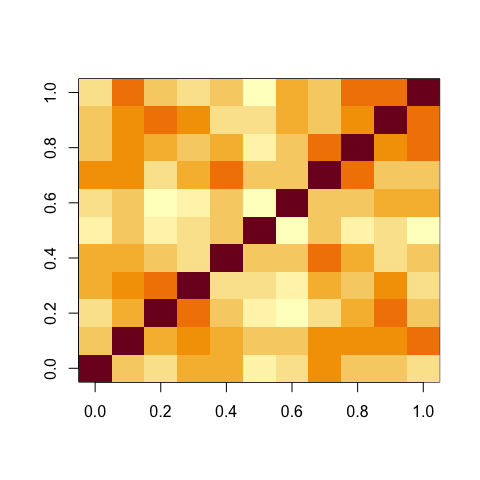
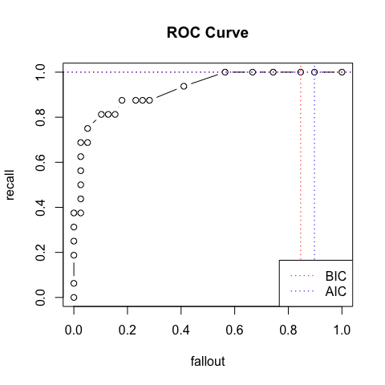
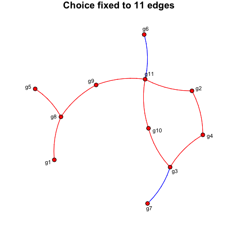
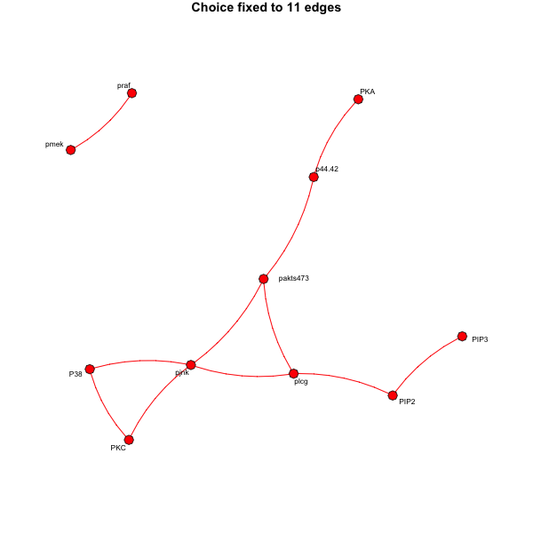

# SIMoNe: Statistical Inference for Modular Networks

> The goal of SIMoNe is to implement methods for the inference of
> co-expression networks based on partial correlation coefficients from
> either steady-state or time-course transcriptomic data. Note that with
> both types of data this package can deal with samples collected in
> different experimental conditions and therefore not identically
> distributed. In this particular case, multiple but related networks
> are inferred on one simone run.

## Installation

``` r
devtools::install_github("cambroise/simone")
```

## Citation

If you use simone in your research, please cite:

> Chiquet J., Smith A., Grasseau G., Matias C., Ambroise C. (2008).
> **SIMoNe: Statistical Inference for MOdular NEtworks.**
> *Bioinformatics*, 25(3), 417–418.
> doi:[10.1093/bioinformatics/btn637](https://doi.org/10.1093/bioinformatics/btn637)

Additional references:
- Ambroise C., Chiquet J., Matias C. (2009). Inferring sparse Gaussian graphical models with latent structure. *Electronic Journal of Statistics*, 3, 205–238. doi:[10.1214/08-EJS314](https://doi.org/10.1214/08-EJS314)

---

## Example

### Simulation of one data set (*n* = 100)

``` r
library(simone)
set.seed(2)
p <- 11
g <- rNetwork(p, pi = 0.2, name = "Theoretical Graph")
plot(g)
True.correlation.matrix <- cov2cor(solve(g$Theta))
data <- rTranscriptData(n = 100, g, sigma = 0)
```



### Computation of the observed correlation matrix

``` r
Rho <- cor(data$X)
image(Rho)
# mean square diff between truth and estimation
mean((Rho - True.correlation.matrix)^2)
#> [1] 0.008621437
# How many independences?
sum(Rho == 0)
#> [1] 0
```



All pairs of variables are dependent since no correlation is set to 0.
So let us compute the partial correlations via the concentration matrix.

### Infer a network with a penalty parameter equal to 0.3

``` r
infered.net <- simone(data$X, control = setOptions(penalties = 0.3))
confusion_matrix <- function(truth, estimation) {
  up <- upper.tri(truth, diag = FALSE)
  graph_theorique <- factor(as.numeric(!truth == 0), levels = c(0, 1))
  graph_infere    <- factor(as.numeric(!estimation == 0), c(0, 1))
  return(table(infere = graph_infere[up], theorique = graph_theorique[up]))
}
(m <- confusion_matrix(truth = g$A, estimation = infered.net$networks[[1]]))
#>       theorique
#> infere  0  1
#>      0 38  8
#>      1  1  8
```

From the confusion matrix we see that the algorithm has 38 TP and 8 TN but does make 9 mistakes.

### Using different penalties

``` r
## Running simone
res <- simone(data$X, type = "steady-state")

## Plotting the results — ROC curve over the penalty path
plot(res, ref.graph = g$A, output = "ROC", ask = FALSE)
```



The best network according to BIC is the following:

``` r
res <- simone(data$X)
selected.net <- getNetwork(res)
plot(selected.net)
confusion_matrix(g$A, selected.net$A)
#>       theorique
#> infere  0  1
#>      0 38  6
#>      1  1 10
```



### The flow-cytometry dataset

The Sachs *et al.* protein signalling dataset can be analysed as follows
(requires internet access):

``` r
source <- "https://web.stanford.edu/~hastie/ElemStatLearn/datasets/sachs.data"
protein_data <- read.table(url(source),
  col.names = c("praf","pmek","plcg","PIP2","PIP3","p44/42",
                "pakts473","PKA","PKC","P38","pjnk"))

grid_lambda <- c(0, 0.01, 0.05, 0.1, 0.5, 1)
op <- par(mfrow = c(2, 3))
for (i in seq_along(grid_lambda)) {
  infered.net <- simone(protein_data, control = setOptions(penalties = grid_lambda[i]))
  plot(getNetwork(infered.net))
}
par(op)

# Best network according to BIC
res <- simone(protein_data)
plot(getNetwork(res))
```

The best network inferred from the Sachs dataset (BIC-selected):


